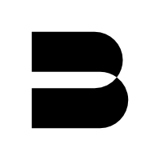

<p align="left" >
  
</p>

# About this project

Bitshop if a proof of concept project that demonstrates capabilities of the Internet Computer blockchain. It is a Shopify alternative running 100 % on-chain with Bitcoin as a native payment. There is no need to install any additional software to use this app – it is all approachable via web browser.

We implemented CRUD support for products, categories, orders. You can also upload images for each product that are also stored on-chain.

Unique BTC address is generated for each order – the backend is able to verify the payment automatically.

We used Sveltekit to build the frontend of this app and the backend is written in the Motoko language, designed to write smart contracts on the IC. All code is open source in this repository.

These features are missing in order to be able to run an online store on Bitshop in real world:

<ul>
  <li>Product Variants</li>
  <li>E-mail confirmations</li>
  <li>Shipping providers integrations</li>
  <li>More payment methods (USDC, ETH, VISA)</li>
  <li>Support for discounts</li>
  <li>Tax and invoices</li>
  <li>Multiple images support</li>
</ul>

If you would like to use Bitshop for your own projects, please let us know what features are most important to you.

<contact@bitshop.info>

<https://twitter.com/bitshopicp>

## Getting started

Make sure you have [node.js](https://nodejs.org/) installed.

```
clone this repo
npm ci
```

## DFX

Install `dfx` by running

```
sh -ci "$(curl -fsSL https://smartcontracts.org/install.sh)"
```

## vessel

Install `vessel` by running

```
wget -qO /usr/local/bin/vessel https://github.com/dfinity/vessel/releases/download/v0.6.5/vessel-linux64
chmod +x /usr/local/bin/vessel
```

Note if you have a different OS, you can find the correct version [here](https://github.com/dfinity/vessel/releases/tag/v0.6.5).

## Start and stop the local replica

Open a new terminal window _in the project directory_, and run the following command to start the local replica. The replica will not start unless `dfx.json` exists in the current directory.

```
dfx start --background
```

When you're done with development, or you're switching to a different dfx project, running

```
dfx stop
```

from the project directory will stop the local replica.

## Configuration

### DFX

To connect to the Bitcoin network, you need to specify address to your (or remote) Bitcoin node in the `dfx.json` file.

```
"bitcoin": {
  "enabled": true,
  "nodes": ["node1-ip:port", "node2-ip:port"],
  "log_level": "info"
},
```

You can also achieve the same by running command:

```
dfx start --enable-bitcoin --bitcoin-node 127.0.0.1:<your_custom_port>
```

See [Internet Computer Bitcoin development](https://internetcomputer.org/docs/current/developer-docs/integrations/bitcoin/local-development) page for more details.

### Motoko

`dfx.json` unfortunately does not support configuration of the Motoko backend.
You can configure the network parameters in the `src/backend/src/config.mo`. The possible values are:

```
#Mainnet
#Testnet
#Regtest
```

## Build & run the dapp

To build and deploy the project locally run

```
dfx deploy
```

When the process completes you'll have a frontend canister running locally. To find the frontend canister's ID, run

```
dfx canister id frontend
```

It will output something similar to `rno2w-sqaaa-aaaaa-aaacq-cai`. Copy this ID and open it in the browser using `http://<canister ID>localhost:8000`, eg. `http://rno2w-sqaaa-aaaaa-aaacq-cai.localhost:8000`.

## Local development

You can serve the frontend in development mode like you normally develop an app using the command

```
npm run dev
```

it is not necessary to deploy it to the frontend canister during development.

## Deploying to the IC

To host the Svelte app on the IC, you'll need to have some cycles available. Cycles pay for the execution of your app, and they are also needed to create canisters.

You can get $20 worth of cycles for free from the [Cycles Faucet](faucet.dfinity.org).

You should have a canister running the cycles wallet on the IC at this point. The cycles wallet makes it easy to pay for canister creation.

You can check the balance by running

```
dfx wallet --network ic balance
```

After making sure you have cycles available you can run

```
dfx deploy --network ic
```

The command will build the project, create a new canister on the IC and deploy the Svelte app into it. The command will also create a new file `canister_ids.json` which will help the dfx tool deploy to the same canister in future updates. You can commit this file in your repository.

You can now open your Svelte app running on the IC. You can find the canister ID in the deploy command output, or use the ID in `canister_ids.json`.

The link to your app is `<canister_id>.ic0.app`. For example if your canister ID is `zgvi5-hiaaa-aaaam-aaasq-cai`, your app will be at `https://zgvi5-hiaaa-aaaam-aaasq-cai.ic0.app/`.
